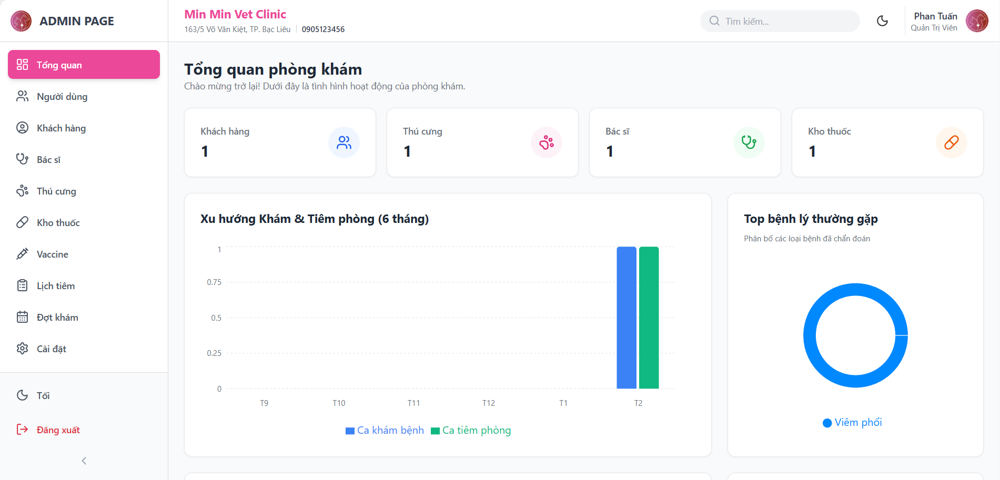
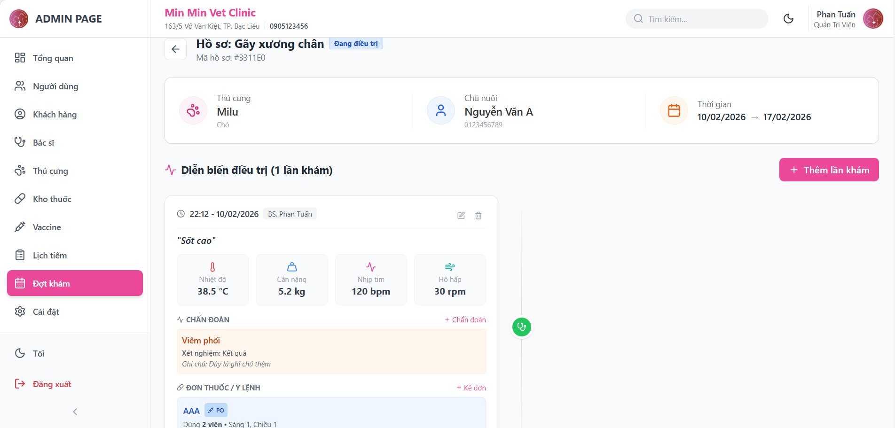

<div align="center">

  <h1>🏥 Vet Clinic Management System</h1>
  <h3>Hệ thống Quản lý Phòng khám Thú y Toàn diện</h3>

  <p>
    Một giải pháp phần mềm hiện đại giúp số hóa quy trình vận hành phòng khám thú y. 
    Hệ thống bao gồm quản lý hồ sơ bệnh án điện tử, theo dõi điều trị nội trú, quản lý kho dược và báo cáo doanh thu thông minh.
  </p>

  <p>
    
    
  </p>

</div>

<br />

# 💻 FRONTEND ADMIN DASHBOARD

Đây là Repository chứa mã nguồn **Frontend**, cung cấp giao diện quản trị trực quan, hiện đại dành cho Bác sĩ và Nhân viên vận hành hệ thống.

## 🛠️ Công nghệ & Phiên bản

Dự án được xây dựng với các công nghệ hiện đại trong hệ sinh thái React/Next.js:

### 🏗️ Core Stack

| Công nghệ | Phiên bản | Vai trò |
|------------|------------|------------|
| **[Next.js](https://nextjs.org/)** | 16.1.6 | Framework React sử dụng App Router, hỗ trợ Server Components, SSR/SSG |
| **[React](https://react.dev/)** | 19.2.3 | Thư viện UI core, xây dựng giao diện Component-based |
| **[react-dom](https://react.dev/learn/rendering-elements)** | 19.2.3 | Thư viện kết xuất DOM cho React |

---

### 🎨 UI & Styling

| Công nghệ | Phiên bản | Vai trò |
|------------|------------|------------|
| **[Tailwind Merge](https://tailwind-merge.vercel.app/)** | 3.4.0 | Hợp nhất class Tailwind thông minh, tránh xung đột style |
| **[clsx](https://github.com/lukeed/clsx)** | 2.1.1 | Utility hỗ trợ xử lý điều kiện className |
| **[lucide-react](https://lucide.dev/)** | 0.563.0 | Bộ icon SVG tối giản và tối ưu cho React |
| **[next-themes](https://github.com/pacocoursey/next-themes)** | 0.4.6 | Quản lý Dark Mode / Light Mode trong Next.js |

---

### 🌐 Networking & API

| Công nghệ | Phiên bản | Vai trò |
|------------|------------|------------|
| **[Axios](https://axios-http.com/)** | 1.13.5 | HTTP Client dùng để gọi API và giao tiếp với Backend |
| **[js-cookie](https://github.com/js-cookie/js-cookie)** | 3.0.5 | Quản lý và thao tác Cookie phía Client |

---

### 📊 Data Visualization

| Công nghệ | Phiên bản | Vai trò |
|------------|------------|------------|
| **[Recharts](https://recharts.org/)** | 3.7.0 | Thư viện xây dựng biểu đồ dựa trên React |

---

### 🔔 User Experience

| Công nghệ | Phiên bản | Vai trò |
|------------|------------|------------|
| **[Sonner](https://sonner.emilkowal.ski/)** | 2.0.7 | Thư viện hiển thị Toast Notification cho React |
| **[date-fns](https://date-fns.org/)** | 4.1.0 | Xử lý và định dạng ngày giờ hiện đại |

## 🌟 Tính năng giao diện

* **📊 Smart Dashboard:**
    * Biểu đồ xu hướng khám chữa bệnh (Bar Chart) trực quan, giúp theo dõi hoạt động phòng khám theo thời gian.
    * Biểu đồ tỷ lệ bệnh lý (Pie Chart) hiển thị phân bổ các loại bệnh, dễ nhận biết các vấn đề chính.
    * Danh sách bệnh nhân nội trú cập nhật Real-time, hỗ trợ theo dõi nhanh.

* **🏥 Quản lý Bệnh án Điện tử:**
    * Giao diện Timeline hiển thị lịch sử khám chữa bệnh theo thứ tự thời gian, dễ quan sát và truy xuất thông tin.
    * Form nhập liệu thông minh cho các chỉ số sinh tồn, chẩn đoán và kê đơn, giúp bác sĩ thao tác nhanh.
    * Tự động tính toán liều lượng thuốc dựa trên dữ liệu nhập, giảm sai sót trong kê đơn.

* **📱 Trải nghiệm người dùng:**
    * Giao diện Responsive, tối ưu trên máy tính bảng và laptop.
    * Hỗ trợ chế độ Dark Mode và Light Mode, nâng cao trải nghiệm người dùng.

* **🌐 Landing Page:**
    * Trang chủ giới thiệu tổng quan dịch vụ phòng khám, thiết kế trực quan và dễ tiếp cận.

## 📸 Demo Giao diện

### Dashboard


### Trang Bệnh án


## 🚀 Cài đặt & Khởi chạy

### 1️⃣ Yêu cầu hệ thống (Prerequisites)

Dự án được xây dựng trên **Next.js 16** và **React 19**, yêu cầu môi trường tối thiểu:

* **Node.js:** >= 18.17.0 (Khuyến nghị **v20.x LTS**)  
* **Package Manager:** npm >= 9, yarn, pnpm hoặc bun

### 2️⃣ Clone & Cài đặt Dependencies

```bash
git clone https://github.com/hvt299/Vet-Clinic-Web.git
cd Vet-Clinic-Web
npm install
```

### 3️⃣ Cấu hình môi trường (.env)

Tạo file `.env` tại thư mục gốc của dự án:

```env
NEXT_PUBLIC_API_URL=http://localhost:3001
```

### 4️⃣ Lệnh chạy (Scripts)

```bash
# Chạy môi trường phát triển (Hot Reload)
npm run dev

# Build ra production (Tối ưu hóa)
npm run build

# Chạy bản production
npm run start
```
Sau khi chạy, truy cập tại:

http://localhost:3000

## 📂 Cấu trúc dự án

```text
src/
├── app/                 # Next.js App Router (Pages & Layouts)
├── components/          # Reusable UI Components (Admin, UI Kit)
├── services/            # API Calls (Axios Service)
└── lib/                 # Utilities & Helpers
```

## 🔗 Kết nối Backend

Dự án này yêu cầu chạy song song với Backend Service (chạy ở cổng 3001) để hoạt động đầy đủ chức năng.

## 👨‍💻 Author

Developed by **Mr.T (hvt299)**  
GitHub: [https://github.com/hvt299](https://github.com/hvt299)